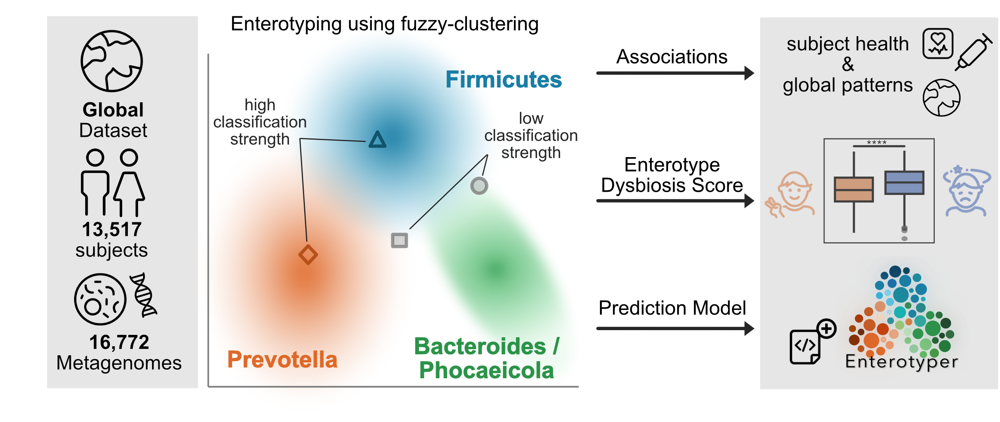
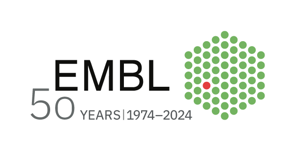
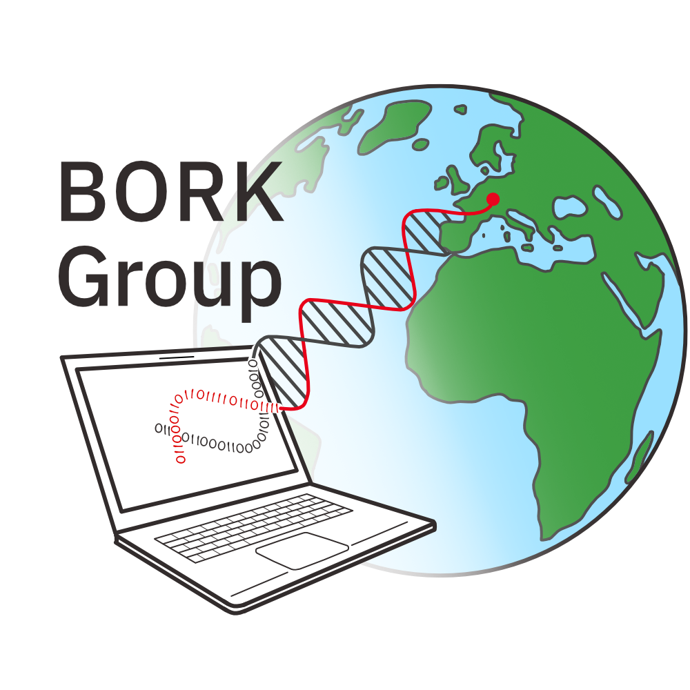

Enterotypes describe human fecal microbiomes grouped by similarity into clusters of microbial community composition, often associated with disease, medications, diet, and lifestyle. Numbers and determinants of enterotypes have been derived by diverse frameworks and applied to study populations that often lack diversity or inter-cohort comparability. To overcome these limitations, we selected 16,193 fecal metagenomes collected in 38 countries to revisit the enterotypes using state-of-the-art fuzzy clustering and found robust clustering regardless of underlying taxonomy, consistent with previous findings. Quantifying the strength of enterotype classifications enriched the enterotype landscape, also reflecting some continuity of microbial compositions. As the classification strength was associated with the patient’s health status, we established an ‘Enterotype Dysbiosis Score’ (EDS) as a latent covariate for various diseases. This global study confirms the enterotypes, reveals a dysbiosis signal within the enterotype landscape, and enables robust classification of metagenomes with an online “Enterotyper” tool, allowing consistent, reproducible analysis in future studies. 

       

This repository contains information for the work preprinted in Keller et al. 2024 "Refined Enterotyping Reveals Dysbiosis in Global Fecal Metagenomes"

        
the prediciton tool "Enterotyper" can be found at [www.enterotype.embl.de](https://enterotype.embl.de/).    

           
This project has received funding from the European Union’s Horizon 2020 research and innovation programme under grant agreement No 825694.

